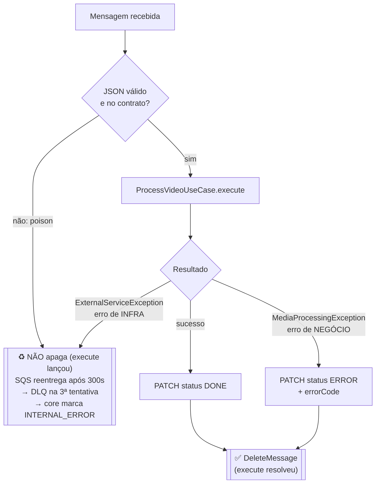

# hackathon-postech-fiap-worker

> **Video Worker** do **FIAP X** — consumidor SQS que extrai frames de vídeos com FFmpeg.
> Projeto desenvolvido para o **Hackathon da Pós-Tech FIAP (Software Architecture)**.

[](https://github.com/leonardo-leosantos/hackathon-postech-fiap-worker/actions/workflows/main.yml)


---

## 1. Objetivo

O desafio do hackathon é evoluir um protótipo de processamento de vídeos para uma
solução **escalável, resiliente e observável**: o usuário envia vídeos, o sistema
extrai frames (1 fps) e devolve um `.zip` com as imagens.

**Este repositório é o Worker**: o serviço que faz o trabalho pesado. Ele **não
expõe API de negócio** — os únicos endpoints HTTP são `/health` (liveness/readiness
para o orquestrador) e `/metrics`. Todo o trabalho é dirigido por mensagens do
Amazon SQS.

Requisitos do enunciado atendidos por este serviço:

| Requisito | Onde é atendido |
|---|---|
| **Extrair frames** e entregar um `.zip` | Pipeline A→F em [`ProcessVideoUseCase`](src/modules/video-processing/application/use-cases/process-video.use-case.ts) — FFmpeg a 1 fps + `archiver` |
| **Não perder requisições** em pico | Long polling no SQS; a mensagem só é apagada quando o resultado é definitivo. Falha de infra volta para a fila |
| Processar **múltiplos vídeos** | Um vídeo por vez **por pod**; a escala é horizontal (réplicas no EKS) — ver [§14](#14-estado-atual-e-limitações-conhecidas) |
| **Nunca deixar o vídeo travado** | Toda falha resulta em `DONE`/`ERROR` no core, ou em reentrega/DLQ (que o core também consome) |
| **Observabilidade** | Métricas Prometheus por etapa do pipeline (`download`, `extract_frames`, `zip`, `upload`, `notify_core`) |
| **Testes** | 14 suítes unitárias + E2E, gate de cobertura **80%** no CI |
| **CI/CD** | GitHub Actions: lint → testes → build/push Docker Hub → deploy EKS |

O que **não** é responsabilidade deste serviço: autenticação, banco de dados,
presigned URLs, e-mail ao usuário. Tudo isso vive no **core**.

---

## 2. Ecossistema — repositórios relacionados

| Repositório | Papel | Link |
|---|---|---|
| **worker** (este repo) | Consumer SQS: download do S3 → FFmpeg → zip → upload → callback de status | https://github.com/leonardo-leosantos/hackathon-postech-fiap-worker |
| **core** | API REST, banco, ciclo de vida do vídeo, notificações. **Publica** a mensagem que este worker consome e **recebe** o callback de status | <!-- 👉 cole o link aqui --> https://github.com/leonardo-leosantos/hackathon-postech-fiap-core |
| **lambda-auth** | Autenticação e emissão do JWT. O worker não interage com ela (usa token interno) | <!-- 👉 cole o link aqui --> https://github.com/lucasffgomes/lambda-auth-fiap |
| **infra** | Terraform: EKS, S3, SQS (fila + DLQ), SNS. Publica os endpoints no SSM Parameter Store | <!-- 👉 cole o link aqui --> https://github.com/leonardo-leosantos/hackathon-postech-fiap-infra |
| **front** | Interface web de testes/demonstração | <!-- 👉 cole o link aqui --> https://github.com/leonardo-leosantos/hackathon-postech-fiap-front |

### Contratos com o core

Os repositórios **não compartilham biblioteca**. Quatro acoplamentos são
explícitos e precisam ser respeitados em qualquer alteração:

1. **Payload da fila** — o core publica, este worker consome. Sem campos extras:
   ```json
   { "videoUid": "uuid", "userUid": "uuid", "blobStorageVideoKey": "videos/<userId>/<videoId>.mp4" }
   ```
2. **Callback de status** — `PATCH ${API_URL}/internal/videos/<videoId>/status`
   com o header `x-internal-token`:
   ```json
   { "status": "DONE",  "blobStorageZipKey": "zips/<userId>/<videoId>.zip" }
   { "status": "ERROR", "errorCode": "CORRUPT_VIDEO", "errorReason": "detalhe técnico" }
   ```
   `errorCode` é **obrigatório** quando `status = ERROR` — sem ele o core responde
   `400`, o que vira erro de infra aqui e a mensagem volta para a fila. Falhar
   ruidosamente é intencional.
3. **Convenção da chave do zip** — `zips/<userId>/<videoId>.zip`, construída em
   [`zip-storage-key.ts`](src/modules/video-processing/domain/value-objects/zip-storage-key.ts)
   e **espelhada** no core. O core usa essa chave para verificar no S3 se o zip
   existe antes de marcar `ERROR` (guarda anti-falso-positivo).
4. **Taxonomia de erro** — o enum [`VideoErrorCode`](src/modules/video-processing/domain/value-objects/video-status.vo.ts)
   é **espelhado** do core. Este worker só emite `CORRUPT_VIDEO`,
   `UNSUPPORTED_FORMAT` e `SOURCE_NOT_FOUND`; `INTERNAL_ERROR` e `TIMEOUT` são
   atribuídos pelo core justamente nos casos em que o worker não conseguiu
   reportar nada.

> ⚠️ Os itens 3 e 4 são espelhados sem lib compartilhada. Se a convenção mudar só
> de um lado, **nada quebra em teste** — a guarda do core simplesmente para de
> encontrar o zip e o usuário volta a receber e-mail de erro para vídeo que
> processou bem, em silêncio. Existem specs de *drift-locking*
> ([`video-status.vo.spec.ts`](src/modules/video-processing/domain/value-objects/video-status.vo.spec.ts),
> [`zip-storage-key.spec.ts`](src/modules/video-processing/domain/value-objects/zip-storage-key.spec.ts))
> que travam os valores literais: se um deles falhar, pergunte se o core mudou —
> não atualize a expectativa.

### Vocabulário no fio ≠ vocabulário do domínio

O worker fala o vocabulário do **core** no fio e traduz nos adapters (padrão
hexagonal). `videoUid`/`userUid`/`blobStorageVideoKey` chegam na mensagem e são
traduzidos para o `ProcessVideoCommand` interno (`videoId`/`userId`/`s3VideoKey`)
em [`parseSqsVideoMessage`](src/adapters/messaging/dtos/sqs-video-message.schema.ts).
Na saída, o adapter HTTP traduz `s3ZipKey` → `blobStorageZipKey`. O domínio nunca
conhece os nomes do core.

---

## 3. O pipeline (A → F)

Para cada mensagem recebida, o [`ProcessVideoUseCase`](src/modules/video-processing/application/use-cases/process-video.use-case.ts)
executa:


| Etapa | O que faz | Adapter |
|---|---|---|
| **A. Download** | Baixa o vídeo do S3 por *streaming* para `/tmp/videos/<videoId>.mp4` (nunca carrega o arquivo em memória) | [`S3VideoStorageAdapter`](src/infra/aws/s3/s3-video-storage.adapter.ts) |
| **B. Extração** | `ffmpeg -i <video> -vf fps=1 /tmp/frames/<videoId>/frame-%04d.jpg` | [`FfmpegFrameExtractorAdapter`](src/infra/ffmpeg/ffmpeg-frame-extractor.adapter.ts) |
| **C. Compactação** | Zipa o diretório de frames em `/tmp/zips/<videoId>.zip` (compressão nível 9) | [`ArchiverFrameArchiverAdapter`](src/infra/archive/archiver-frame-archiver.adapter.ts) |
| **D. Upload** | Envia o `.zip` para `zips/<userId>/<videoId>.zip` com `ContentType: application/zip` | `S3VideoStorageAdapter` |
| **E. Callback** | `PATCH /internal/videos/<videoId>/status` no core (timeout 10s, header `x-internal-token`) | [`HttpCoreApiAdapter`](src/infra/http/clients/core-api/http-core-api.adapter.ts) |
| **F. Cleanup** | Remove vídeo, frames e zip do `/tmp`. Roda no `finally` — **sempre**, sucesso ou falha, e **nunca lança** | [`LocalTempWorkspaceAdapter`](src/infra/filesystem/local-temp-workspace.adapter.ts) |

Cada etapa é cronometrada individualmente no histograma
`video_processing_duration_seconds{step,status}` — dá para ver exatamente onde o
tempo é gasto e qual etapa falhou.

---

## 4. Semântica de erro — o invariante central do projeto

**O que decide se a mensagem é apagada do SQS é apenas isto: `execute()` resolveu
ou lançou.** Toda a resiliência do sistema depende dessa distinção.



| Cenário | Classificação | `errorCode` enviado | Mensagem no SQS |
|---|---|---|---|
| Frames extraídos e zip enviado | sucesso | — (`DONE`) | **apagada** |
| FFmpeg falhou ao decodificar | negócio | `CORRUPT_VIDEO` | **apagada** |
| FFmpeg terminou com **0 frames** | negócio | `UNSUPPORTED_FORMAT` | **apagada** |
| Objeto não existe no S3 (`NoSuchKey`/`NotFound`/404) | negócio | `SOURCE_NOT_FOUND` | **apagada** |
| S3/rede/core fora, timeout | infra | — (o core atribui `INTERNAL_ERROR` pela DLQ) | **mantida** → DLQ |
| FFmpeg ausente na imagem, disco cheio (`ENOSPC`) | **infra** | — | **mantida** → DLQ |
| JSON inválido / fora do contrato (*poison*) | — | — | **mantida** → DLQ |

Três decisões de projeto que essa tabela codifica:

1. **Erro de negócio não gasta retry.** Vídeo corrompido daria o mesmo resultado
   nas 3 tentativas. Marcar `ERROR` na primeira e apagar a mensagem economiza 15
   minutos de visibility timeout e devolve resposta ao usuário imediatamente.
   `SOURCE_NOT_FOUND` entra aqui pelo mesmo motivo: objeto ausente é permanente —
   tratá-lo como infra deixaria o vídeo travado em `PROCESSING` até a DLQ.
2. **Falha nossa nunca culpa o arquivo do usuário.** `ffmpeg` ausente ou disco
   cheio são falhas de plataforma. Se fossem classificadas como negócio, o
   usuário receberia "seu vídeo está corrompido" por causa de um bug nosso. Por
   isso [`classifyFfmpegError`](src/infra/ffmpeg/ffmpeg-frame-extractor.adapter.ts)
   procura assinaturas de *spawn failure* (`ENOENT`, `EACCES`, `spawn ffmpeg`) e
   de disco cheio **antes** de assumir vídeo corrompido.
3. **Falha no callback também é infra.** Se o zip subiu mas o `PATCH` falhou, a
   mensagem volta para a fila. Se esgotar as tentativas, o core encontra o zip no
   S3 pela convenção de chave e reconcilia para `DONE` em vez de mandar e-mail de
   erro.

O `errorReason` carrega a cauda do stderr do ffmpeg (últimas 10 linhas, no máximo
800 chars) — é o que realmente diagnostica (`moov atom not found`,
`Invalid data found when processing input`). Vai para `video_errors.error_reason`
no core, para post-mortem, e **nunca é mostrado ao usuário**.

> **Ao editar o use case ou o consumer, preserve o contrato resolve-vs-throw.** É
> ele que mapeia tipo de erro para comportamento de ACK/retry/DLQ.

---

## 5. Arquitetura

Arquitetura **hexagonal (ports & adapters)**. Todo o serviço é um único módulo de
feature: `VideoProcessingModule`. O domínio não conhece AWS, FFmpeg, axios nem
sistema de arquivos — apenas interfaces.

```
src/
├── modules/
│   ├── video-processing/                 # 🟢 DOMÍNIO + APLICAÇÃO
│   │   ├── domain/
│   │   │   ├── ports/                    #   VIDEO_STORAGE, FRAME_EXTRACTOR,
│   │   │   │                             #   FRAME_ARCHIVER, CORE_API, TEMP_WORKSPACE
│   │   │   ├── exceptions/               #   MediaProcessingException (erro de negócio)
│   │   │   └── value-objects/            #   VideoErrorCode, buildZipStorageKey
│   │   ├── application/
│   │   │   ├── dtos/                     #   ProcessVideoCommand (vocabulário interno)
│   │   │   └── use-cases/                #   ProcessVideoUseCase — o pipeline A→F
│   │   └── video-processing.module.ts    #   wiring: token → adapter
│   └── shared/                           #   DomainException, LoggerPort
│
├── adapters/
│   └── messaging/dtos/                   # 🔵 schema zod da mensagem + tradução do contrato
│
├── infra/                                # 🟠 ADAPTERS DE INFRAESTRUTURA
│   ├── messaging/consumers/              #   SqsVideoConsumer (driving adapter)
│   ├── aws/s3/                           #   S3VideoStorageAdapter
│   ├── ffmpeg/                           #   FfmpegFrameExtractorAdapter
│   ├── archive/                          #   ArchiverFrameArchiverAdapter
│   ├── filesystem/                       #   LocalTempWorkspaceAdapter
│   ├── http/clients/core-api/            #   HttpCoreApiAdapter (axios)
│   ├── http/modules/health/              #   /health e /health/ready
│   ├── http/modules/metrics/             #   /metrics (Prometheus)
│   └── logging/                          #   NestLoggerAdapter
│
└── config/                               #   env.schema.ts (zod) + AppConfigService tipado
```

### Ports e adapters

| Port (token `Symbol`) | Adapter | Tecnologia |
|---|---|---|
| `VIDEO_STORAGE` | `S3VideoStorageAdapter` | AWS SDK v3 (`@aws-sdk/client-s3`) |
| `FRAME_EXTRACTOR` | `FfmpegFrameExtractorAdapter` | `fluent-ffmpeg` + binário de sistema |
| `FRAME_ARCHIVER` | `ArchiverFrameArchiverAdapter` | `archiver` v7 |
| `CORE_API` | `HttpCoreApiAdapter` | axios |
| `TEMP_WORKSPACE` | `LocalTempWorkspaceAdapter` | `node:fs/promises` |
| `LOGGER` | `NestLoggerAdapter` | `Logger` do NestJS |

O wiring fica em [`video-processing.module.ts`](src/modules/video-processing/video-processing.module.ts).
Adicionar uma capacidade nova = definir um port (interface + `Symbol`), escrever
o adapter e registrar ali. Trocar S3 por outro storage é trocar uma linha.

**Driving adapter.** [`SqsVideoConsumer`](src/infra/messaging/consumers/sqs-video.consumer.ts)
é um provider comum do Nest que inicia o long polling em
`onApplicationBootstrap` e faz *drain* em `onModuleDestroy`. É ele quem decide
apagar ou não a mensagem — o use case só resolve ou lança.

> Muitos `index.ts` sob `src/infra/database/typeorm/*`, `src/adapters/*` e
> `src/infra/http/{filters,middleware}` são `export {}` vazios, herdados de um
> template compartilhado com o core. **Este worker não tem banco de dados nem
> controllers de negócio** — não assuma que essas camadas existem.

---

## 6. Stack tecnológica

| Camada | Tecnologia |
|---|---|
| Runtime / linguagem | Node.js 20, TypeScript 5.7 |
| Framework | NestJS 11 (usado como container de DI e ciclo de vida; o HTTP só serve health/metrics) |
| Mensageria | Amazon SQS — long polling de 20s, `MaxNumberOfMessages: 1`, visibility timeout 300s |
| Armazenamento | Amazon S3 (`@aws-sdk/client-s3`), download e upload por *streaming* |
| Processamento de mídia | **FFmpeg** (binário de sistema, `apk add ffmpeg`) via `fluent-ffmpeg` |
| Compactação | `archiver` v7 (v8 é ESM-only e quebraria o `require` do build CommonJS) |
| HTTP client | axios (timeout 10s) |
| Validação | `zod` — mensagens do SQS **e** variáveis de ambiente (fail-fast no boot) |
| Observabilidade | Prometheus (`prom-client` + `@willsoto/nestjs-prometheus`) |
| Testes | Jest, `aws-sdk-client-mock`, Supertest |
| Empacotamento | Docker multi-stage (`node:20-alpine` + ffmpeg, usuário não-root uid 1001) |
| Orquestração | Kubernetes (EKS) |
| CI/CD | GitHub Actions → Docker Hub → EKS |

Sem banco de dados, sem Redis, sem ORM — por isso o job de testes do CI não sobe
*service container* nenhum.

---

## 7. Endpoints HTTP

O worker **não tem API de negócio**. Os únicos endpoints existem para o
orquestrador e para a coleta de métricas:

| Método | Rota | Descrição |
|---|---|---|
| `GET` | `/health` | Liveness. Usado pelo `HEALTHCHECK` do Docker e pelas probes `startupProbe`/`livenessProbe` |
| `GET` | `/health/ready` | Readiness (`readinessProbe`) |
| `GET` | `/metrics` | Métricas em formato Prometheus |

Porta padrão: **3001** (`PORT`).

> ⚠️ As probes são **estáticas**: provam que o processo está vivo, **não** que o
> consumer está conseguindo falar com o SQS. Um worker com credencial expirada
> passa no health check e não processa nada — o sinal real disso é
> `video_processing_total` parado e a fila crescendo.

---

## 8. Como executar

### Pré-requisitos

- Node.js 20+ e npm
- Docker + Docker Compose
- **FFmpeg instalado no host** se for rodar fora do Docker (`brew install ffmpeg`
  no macOS, `apt install ffmpeg` no Linux). Na imagem Docker ele já vem.
- Um arquivo `.env` na raiz: `cp .env.example .env`
- **O compose do core precisa estar de pé primeiro** — ver abaixo.

### ⚠️ Dependência de ordem: suba o core antes

O worker não provisiona infraestrutura AWS local. Ele se conecta ao **LocalStack
provisionado pelo repositório do core** (bucket S3, fila `video-processing` + DLQ,
tópico SNS), por uma rede Docker externa:

```yaml
core-network:
  external: true
  name: hackathon-postech-fiap-core_postgres
```

Se o compose do core não estiver de pé, o Docker responde `network not found`.

### Opção A — ciclo completo com Docker (recomendado para avaliação)

```bash
# 1) No repositório do CORE — sobe Postgres, Redis, LocalStack (bucket + filas + tópico) e a API
cd ../hackathon-postech-fiap-core
cp .env.example .env
docker compose up -d --build

# 2) Neste repositório — sobe o worker na rede compartilhada
cd ../hackathon-postech-fiap-worker
cp .env.example .env
docker compose up -d --build app
docker compose logs -f app
```

Dentro do compose, o worker sobrescreve os endpoints para os nomes de rede:
`AWS_ENDPOINT=http://localstack:4566` e
`API_URL=http://hackathon-postech-fiap-core-app:3000`.

Log esperado no boot:

```
Video Worker started, listening for SQS messages (health on port 3001)
SQS video consumer started — listening for messages
```

### Opção B — worker local (sem Docker) + LocalStack em container

```bash
# infraestrutura + API, no repo do core
cd ../hackathon-postech-fiap-core && docker compose up -d postgres redis localstack app

# worker no host, com watch
cd ../hackathon-postech-fiap-worker
npm install
npm run start:dev
```

O `.env.example` já vem apontando para `localhost` em `AWS_ENDPOINT`,
`SQS_QUEUE_URL` e `API_URL` — é exatamente essa a configuração deste modo.
Requer **FFmpeg no PATH do host**.

### Opção C — build de produção local

```bash
npm run build
npm run start:prod    # node dist/main
```

### Demais comandos

```bash
npm run start:debug   # watch + inspector
npm run lint          # eslint --fix
npm run format        # prettier --write
```

### Roteiro de validação ponta a ponta

1. Gere um JWT no repo do core: `node generate-token.js`
2. `POST /api/videos/upload-request` no Swagger do core (http://localhost:3000/api-docs)
3. Faça o `PUT` do vídeo na presigned URL devolvida
4. `POST /api/videos/confirm-upload` com o header `X-Idempotency-Key`
5. Acompanhe `docker compose logs -f app` **neste** repo — o pipeline A→F aparece
   etapa por etapa
6. `GET /api/videos` no core deve mostrar `DONE`; `GET /api/videos/:id/download`
   devolve a presigned URL do `.zip`

Roteiro detalhado em [`prompts/integracao-localstack-core.md`](prompts/integracao-localstack-core.md).

Para inspecionar a fila e o bucket durante o teste:

```bash
alias awslocal='docker compose -f ../hackathon-postech-fiap-core/docker-compose.yaml exec localstack awslocal'

awslocal sqs get-queue-attributes \
  --queue-url http://localhost:4566/000000000000/video-processing \
  --attribute-names ApproximateNumberOfMessages
awslocal s3 ls s3://hackathon-videos/zips/ --recursive
```

---

## 9. Variáveis de ambiente

Copie `.env.example` para `.env`. As variáveis são validadas com **zod no boot
(fail-fast)** — falta ou formato inválido derruba a aplicação com a lista de
problemas, em vez de falhar em runtime na primeira mensagem. Schema em
[`src/config/env.schema.ts`](src/config/env.schema.ts); acesso tipado via
[`AppConfigService`](src/config/app-config.service.ts) (nenhum outro arquivo lê
`process.env`).

### Obrigatórias

| Variável | Descrição |
|---|---|
| `AWS_REGION` | Região AWS |
| `AWS_ACCESS_KEY_ID` | Credencial AWS (`test` no LocalStack) |
| `AWS_SECRET_ACCESS_KEY` | Credencial AWS (`test` no LocalStack) |
| `SQS_QUEUE_URL` | URL da fila de entrada. Precisa ser uma **URL válida** |
| `S3_BUCKET_NAME` | Bucket de origem (vídeos) e destino (zips) |
| `API_URL` | Base URL da Core API. Precisa ser uma **URL válida** |
| `INTERNAL_API_TOKEN` | Enviado no header `x-internal-token`. **Deve ser idêntico ao do core** |

### Opcionais

| Variável | Default | Descrição |
|---|---|---|
| `NODE_ENV` | `development` | `development` \| `test` \| `production` |
| `PORT` | `3001` | Porta do `/health` e `/metrics` |
| `AWS_SESSION_TOKEN` | — | **Só com credenciais temporárias** (STS / AWS Academy), que são rejeitadas sem ele. Deixe **comentado** quando não houver: o schema rejeita string vazia |
| `AWS_ENDPOINT` | — | **Só LocalStack.** Ausente em produção → o SDK usa a AWS real. Quando presente, o cliente S3 também liga `forcePathStyle` (fora da AWS o SDK não resolve `<bucket>.<host>`) |

---

## 10. Resiliência

Cada mecanismo abaixo existe para um modo de falha concreto:

| Mecanismo | Onde | Protege contra |
|---|---|---|
| **Contrato resolve-vs-throw** | use case ↔ consumer | erro permanente queimando 3 retries, e erro transitório sendo tratado como definitivo — ver [§4](#4-semântica-de-erro--o-invariante-central-do-projeto) |
| **Guarda de 0 frames** | extrator FFmpeg | o pior tipo de falha: exit code 0 sem frames viraria `DONE` com **zip vazio**, e o usuário baixaria um arquivo inútil achando que deu certo |
| **Classificação infra vs. negócio no FFmpeg** | `classifyFfmpegError` | dizer ao usuário que o arquivo dele está corrompido quando o problema foi ffmpeg ausente ou disco cheio |
| **Assinaturas buscadas só em `err.message`** | idem | o stderr do ffmpeg traz a linha `configuration:` com todas as flags de build em **toda** execução; casar contra ele daria falso positivo e inverteria exatamente a classificação que o mecanismo existe para garantir |
| **Workspace limpo na criação** | `LocalTempWorkspaceAdapter.create` | worker morto por OOM deixa `/tmp/frames/<videoId>` para trás; na reentrega ao mesmo container a guarda de 0 frames veria os frames velhos, passaria, e o vídeo viraria `DONE` com **zip obsoleto** |
| **Remoção apenas dos paths do job** | idem | apagar as raízes `/tmp/videos` e `/tmp/zips` destruiria artefatos de jobs paralelos (hoje o consumer é serial, mas o dia em que isso mudar não deve criar corrupção silenciosa) |
| **Cleanup no `finally`, que nunca lança** | `cleanup` | vazamento de disco entre jobs; e mascarar o erro real do pipeline com um erro de remoção |
| **Backoff no `receive`** | consumer, 5s | falha de infra no próprio `ReceiveMessage` derrubando o loop de polling — ele espera e tenta de novo |
| **Visibility timeout de 300s** | consumer | outro pod pegar a mesma mensagem enquanto o vídeo ainda está sendo processado |
| **Shutdown gracioso com drain** | `onModuleDestroy` + `main.ts` | SIGKILL no meio do job queimaria 1 das 3 tentativas sem nenhum progresso. `app.close()` só resolve quando a iteração corrente termina |
| **`process.exit` explícito** | [`main.ts`](src/main.ts) | o node roda como **PID 1** no container e o re-raise de sinal que o Nest faz é ignorado pelo kernel para PID 1 — o processo ficava vivo até o SIGKILL no fim dos 300s de grace, atrasando todo rollout |
| **`terminationGracePeriodSeconds: 300`** | deployment | k8s matando o pod antes de ele terminar o vídeo em andamento |
| **`maxSurge: 1` / `maxUnavailable: 0`** | deployment | ficar sem worker durante o rollout, enquanto o pod antigo ainda drena |
| **`errorReason` truncado em 1000 chars** | `HttpCoreApiAdapter` | o stderr do ffmpeg é enorme e o core rejeitaria o `PATCH` com `400` por tamanho |
| **Não-2xx do core tratado como erro** | idem | perder silenciosamente a atualização de status (axios lança em não-2xx, então o `400` por `errorCode` faltando falha ruidosamente) |
| **`emptyDir` montado em `/tmp`** | deployment | os paths de trabalho são fixos e o container roda como uid 1001 — precisa de um `/tmp` gravável |
| **Validação de env no boot** | `env.schema.ts` | descobrir que falta `SQS_QUEUE_URL` só na primeira mensagem, meia hora depois do deploy |

---

## 11. Observabilidade

Métricas em **http://localhost:3001/metrics** (formato Prometheus, com as
`defaultMetrics` de processo habilitadas).

| Métrica | Tipo | Labels |
|---|---|---|
| `video_processing_duration_seconds` | histogram | `step`, `status` |
| `video_processing_total` | counter | `status` |

Valores de `step`: `download`, `extract_frames`, `zip`, `upload`, `notify_core`,
`notify_core_error`, `total`.
Valores de `status`: `success` / `failed` (por etapa) e `success` /
`business_error` / `infra_error` (no `total` e no counter).

Os buckets do histograma vão até **300s** — processamento de vídeo é medido em
minutos, não em milissegundos.

### Prometheus e Grafana

A stack de monitoramento (Prometheus + Grafana com dashboards provisionados) vive
no **repositório do core** e já raspa este worker:

```yaml
- job_name: 'hackathon-worker-api'
  static_configs:
    - targets: ['hackathon-postech-fiap-worker-app:3001']
```

Com as duas stacks de pé:

| Recurso | URL |
|---|---|
| Métricas do worker | http://localhost:3001/metrics |
| Prometheus | http://localhost:9090 — em **Status → Targets**, `hackathon-worker-api` deve estar `UP` |
| Grafana | http://localhost:3003 (`admin` / `admin`) — dashboard do worker provisionado |

> Rodando o worker **fora** do Docker (`npm run start:dev`), o target
> `hackathon-postech-fiap-worker-app:3001` fica `DOWN`. Descomente o alvo
> `host.docker.internal:3001` no `prometheus.yml` do core e comente o de
> produção — **um de cada vez, nunca os dois**: as portas estão mapeadas no host,
> então os dois alvos alcançariam o mesmo processo e toda agregação dobraria.

---

## 12. Testes

```bash
npm test                   # unitários (*.spec.ts em src/) — 14 suítes
npm run test:watch
npm run test:cov           # cobertura -> coverage/  (gate: 80%)

npm run test:e2e           # E2E (test/app.e2e-spec.ts)
npm run test:cov:e2e
npm run test:cov:all       # unit + e2e

npm test -- process-video   # arquivo único por fragmento de nome
```

O gate de **80%** (statements, branches, functions, lines) está em
`jest.coverageThreshold` no `package.json` e é aplicado no CI.

**Nenhum teste toca a rede.** O S3 e o SQS são simulados com
`aws-sdk-client-mock`; o E2E sobe o `AppModule` inteiro mas faz
`.overrideProvider(SqsVideoConsumer).useValue({})`, então o long polling nunca
inicia. Isso é o que permite ao CI rodar sem LocalStack — só é preciso satisfazer
a validação de env do boot com valores dummy:

```bash
AWS_REGION=us-east-1 AWS_ACCESS_KEY_ID=test AWS_SECRET_ACCESS_KEY=test \
SQS_QUEUE_URL=https://sqs.us-east-1.amazonaws.com/000000000000/dummy \
S3_BUCKET_NAME=dummy API_URL=http://localhost:3000 INTERNAL_API_TOKEN=dummy \
  npm run test:e2e
```

Duas suítes merecem atenção especial:
[`video-status.vo.spec.ts`](src/modules/video-processing/domain/value-objects/video-status.vo.spec.ts)
e [`zip-storage-key.spec.ts`](src/modules/video-processing/domain/value-objects/zip-storage-key.spec.ts)
travam os valores espelhados do core. **São a única barreira automática contra
drift entre os dois repos** — se uma delas falhar, verifique se o core mudou antes
de atualizar a expectativa.

---

## 13. CI/CD e deploy

Pipeline: [`.github/workflows/main.yml`](.github/workflows/main.yml) — dispara em
push na `master` e via `workflow_dispatch`.

```
🧪 test                  →  🐳 build                   →  🚀 deploy
lint (sem --fix)            buildx, target=production     SSM → kubeconfig → ConfigMap
unit + coverage gate 80%    (estágio que instala ffmpeg)  + Secret → apply k8s/ → set image
e2e (env dummy, sem AWS)    Docker Hub :<sha> e :latest   → rollout restart → rollout status
```

### Kubernetes

| Item | Valor |
|---|---|
| Namespace | `hackathon` (aplicado por este pipeline também, de forma idempotente — remove dependência de ordem com o core) |
| Deployment | `hackathon-worker` |
| Container | `worker` (o nome importa: o `kubectl set image` do pipeline usa `worker=...`) |
| Imagem | `leonardosant/hackathon-worker` — tag `:<git-sha>` no deploy, `:latest` também publicada |
| Réplicas | `1`, sem HPA — ver [§14](#14-estado-atual-e-limitações-conhecidas) |
| Recursos | requests `500m` CPU / `512Mi` / `2Gi` ephemeral · limits `1000m` / `1Gi` / `5Gi` |
| Grace period | `300s` (igual ao visibility timeout da fila) |
| Volume | `emptyDir` em `/tmp` |

### Config: nada é lido do SSM em runtime

O repositório de infra publica os endpoints no SSM sob `/hackathon/...`; o
**pipeline** lê e materializa o ConfigMap `worker-app-config`. O app só enxerga
variáveis de ambiente.

| Parâmetro SSM | Chave do ConfigMap |
|---|---|
| `/hackathon/eks/cluster-name` | — (usado no `update-kubeconfig`) |
| `/hackathon/sqs/video-processing/url` | `SQS_QUEUE_URL` |
| `/hackathon/s3/videos-bucket/name` | `S3_BUCKET_NAME` |

Chaves fixas: `NODE_ENV=production`, `PORT=3001` e
`API_URL=http://hackathon-core-service.hackathon.svc.cluster.local` — DNS interno
do cluster, ou seja, **o callback de status nunca sai para a internet**.

`AWS_ENDPOINT` **não existe em produção**: é override de LocalStack e, se setado,
o worker tentaria falar com `localstack:4566`.

### Secrets do GitHub

| Secret | Observação |
|---|---|
| `AWS_ACCESS_KEY_ID` / `AWS_SECRET_ACCESS_KEY` / `AWS_SESSION_TOKEN` | trio AWS Academy — rotaciona a cada ~4h; o token de sessão é **obrigatório** |
| `DOCKERHUB_USERNAME` / `DOCKERHUB_TOKEN` | push da imagem |
| `K8S_INTERNAL_API_TOKEN` | **mesmo valor** do secret homônimo no repo do core |

> **Por que existe um `rollout restart` no pipeline:** quando o deploy é
> re-executado apenas para renovar as credenciais Academy (mesma imagem/SHA), o
> `kubectl set image` é *no-op* e os pods não recarregariam o Secret. Com imagem
> nova isso gera um segundo rollout — trade-off aceito.
>
> O `rollout status` usa timeout de **600s**, maior que o
> `terminationGracePeriodSeconds` de 300s: o pod antigo pode levar o grace inteiro
> para morrer, e com timeout igual ao grace o verify perderia a corrida mesmo com
> o pod novo saudável.

Validação dos manifests sem cluster:

```bash
kubectl apply --dry-run=client -f k8s/ -R
```

---

<p align="center">
  Hackathon Pós-Tech FIAP — Software Architecture
</p>
